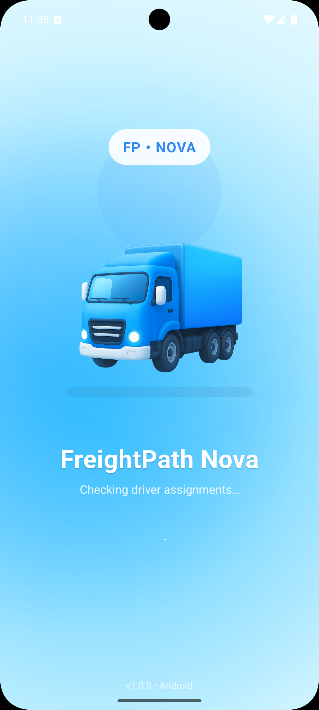
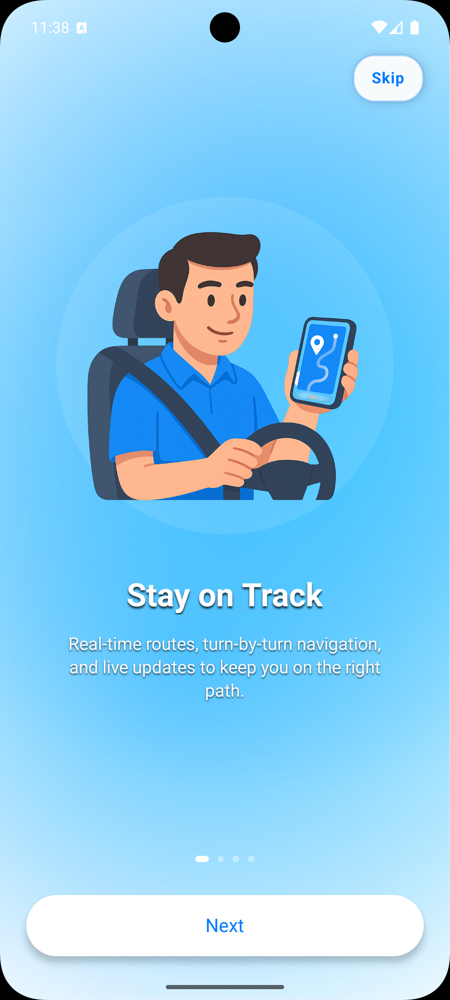
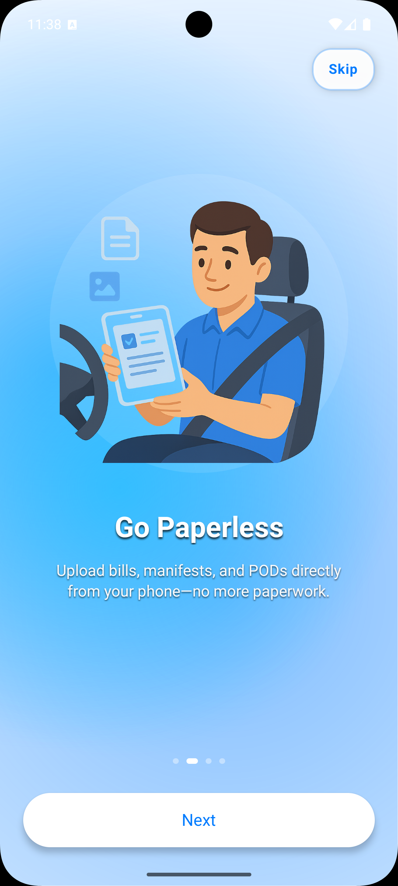
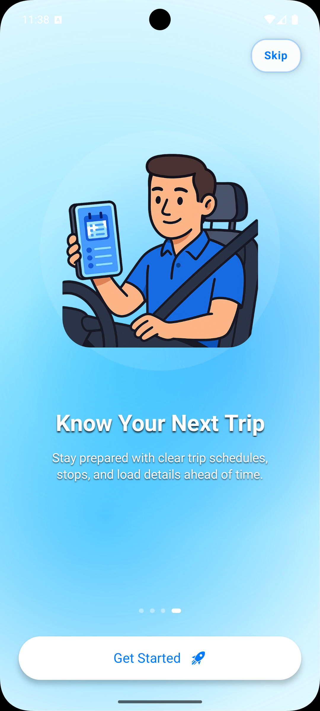

<h1 align="center"> Vrushali Prajapati</h1>

<h3 align="center"> Senior Mobile Tech Lead | React Native | Android (Kotlin/Java) | Cloud (AWS/Azure)</h3>

  <a href="mailto:sonivrushali1234@gmail.com"><b>Email</b></a> •
  <a href="https://www.linkedin.com/in/vrushali-prajapati/"><b>LinkedIn</b></a> •
  <a href="https://github.com/VrushaliSoni9824"><b>GitHub</b></a>

---

## 👩🏻‍💻 About Me
I am a **Senior Mobile Application Developer / Tech Lead** with 5+ years of experience building **enterprise-grade mobile applications** using:

- React Native  
- Native Android (Kotlin/Java)  
- Kotlin Multiplatform Mobile (KMM)  
- AWS & Azure cloud integrations  
- Modular & micro-architecture  
- CI/CD automation  

I specialize in designing **scalable mobile architectures**, optimizing performance, leading teams, mentoring developers, and delivering applications used by thousands of users. Many of my apps are **live on Google Play and App Store**.

---

## 🛠 Technical Skills

### 📱 Mobile Development
React Native, Kotlin, Java, Android SDK, Jetpack Compose, KMM, iOS, Expo, OTA Updates

### 🧩 Architecture & Patterns
MVVM, Clean Architecture, MVI, Modular Architecture, Micro-architecture, Dagger/Hilt, Coroutines

### 💻 Frontend
React Native, ReactJS (Hooks, Redux, Navigation, Reanimated)

### 🗄 Backend
Node.js, PHP, ASP.NET MVC

### 💾 Databases
MySQL, MongoDB

### ☁ Cloud & DevOps
AWS (Lambda, API Gateway, DynamoDB, S3)  
Azure (Functions, DevOps)  
CI/CD • GitHub Actions • Jenkins

### 🔧 Tools
Postman, Firebase, Android Studio, VS Code, IntelliJ, Git, JIRA

---

## Featured Projects (Live)

### ⭐ 1. FreightPath Driver App — Enterprise TMS Mobile Application
✔ Real-time trip management  
✔ Stop workflow updates  
✔ Document capture & POD  
✔ Driver location tracking  
✔ Offline support  
✔ Integrated with enterprise TMS backend  

📲 **Android (Legacy):** https://play.google.com/store/apps/details?id=io.freightpath.driverapp&hl=en  
📲 **iOS (Legacy):** https://apps.apple.com/ca/app/freightpath-driver-app/id1485004257  

## 📸 FreightPath Driver App — Rebuild Screenshots (In Progress)

Below are some **UI screens from the next-generation FreightPath Driver App** that I'm currently rebuilding using **React Native + Modular Architecture + AWS backend integration**.  
These showcase the **modern UI**, improved **driver workflows**, and **optimized performance**.

<table>
<tr>
<td align="center"> </td>

<td align="center"> </td>

<td align="center"> </td>
</tr>

<tr>
<td align="center"> </td>

<td align="center"> </td>

</tr>
</table>

### ⭐ 2. Palgeo — Geo-Fencing Attendance App
✔ Facial recognition  
✔ Geo-fencing  
✔ Offline-first architecture  
📲 **Android:** https://play.google.com/store/search?q=palgeo  
📲 **iOS:** https://apps.apple.com/in/app/palgeo-geoattendance-app/id1565128142  

---

### ⭐ 3. ClockTos — Educational App
✔ Real-time GPS bus tracking  
✔ Parent notifications  
✔ Attendance workflows  
📲 **Android:** https://play.google.com/store/search?q=clocktos  
📲 **iOS:** https://apps.apple.com/in/app/clocktos/id1572663673  

---

### ⭐ 4. Olympiad Practice App (Naskay)
✔ Competitive practice tests  
✔ Timed quizzes  
✔ Leaderboards  
📲 **Android:** https://play.google.com/store/apps/details?id=com.naskay.olympiadpractice  
📲 **iOS:** https://apps.apple.com/us/app/practido-olympiad-practice/id6746647468  

---

### ⭐ 5. AI-Proctored Interview Platform
✔ Facial recognition  
✔ Behavior monitoring  
✔ Safe exam browser  
✔ TensorFlow Lite  
🔗 **Live:** https://assessment.talentigo.ai/admin  
🎥 **Demo:** https://youtu.be/2muVHD_za0o  

---

## 📦 Other Production Apps (Play Store)

### 🔹 MoolahPoints — Cashback & Rewards  
📲 https://play.google.com/store/apps/details?id=app.moolahpoints  

### 🔹 Retailz POS — Inventory & Billing  
📲 https://play.google.com/store/apps/details?id=com.patelprocessing.retailzpos  

### 🔹 MenuOnline Remote & Business — Digital Signage Controller 
📲 https://play.google.com/store/apps/details?id=com.nento.menuonlinebusinesses  
Cloud-based remote manager for Android TV digital signage. Includes content scheduling, layouts, playback, and real-time configuration.

### 🔹 MenuOnline TV Player — Android TV Digital Signage App  
📲 https://play.google.com/store/apps/details?id=com.mycirclenet.player.app  
Displays dynamic menus, specials, videos, and promotional content on Android TV digital signage.

### 🔹 Digital Signage App  
📲 https://play.google.com/store/apps/details?id=com.nento.mycirclebusiness  

---

## 🎓 Education

- **M.Sc. Computing & Data Analytics — Saint Mary’s University, Halifax, Canada**  
- **Master of Computer Applications (CGPA: 9.28)** — UKA Tarsadia University  
- **Bachelor of Computer Applications (CGPA: 8.5)** — VNSGU  

---

## 🏆 Certifications
- **Certified App Developer — IIHT (A Grade)**

---

## 🤝 Connect With Me
 **Email:** sonivrushali1234@gmail.com  
 **LinkedIn:** https://www.linkedin.com/in/vrushali-prajapati  
 **GitHub:** https://github.com/VrushaliSoni9824  

---

